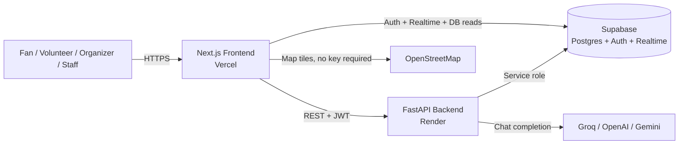

# Stadium AI — GenAI Stadium Operations Platform (FIFA World Cup 2026)

A GenAI-enabled web platform that improves stadium navigation, crowd management,
accessibility, and multilingual assistance for fans, volunteers, organizers, and
venue staff — built for the FIFA World Cup 2026 problem statement.

## Features

- **Multilingual AI Assistant** — floating chat widget (Groq/Llama by default,
  swappable to OpenAI or Gemini) answers questions in any language about gates,
  accessibility, transport, and sustainability.
- **Interactive Stadium Map** — powered by **Leaflet + OpenStreetMap** (no API
  key or billing account required); shows gates, accessibility markers, and
  congestion status.
- **Live Crowd Density Dashboard** — staff/organizer/volunteer manually report
  zone density; updates broadcast instantly to everyone via **Supabase Realtime**.
- **Role-based Dashboards** — Fan, Volunteer, Organizer/Admin, Venue Staff, each
  with a tailored view and permissions.
- **Announcements** — organizers/staff post targeted, severity-tagged updates.
- **Accessibility-first UI** — semantic HTML, labeled forms, keyboard navigation,
  dark mode, high-contrast components.
- **Custom error pages** — 404 and error boundary, on-theme.

## Technology Stack

| Layer | Choice |
|---|---|
| Frontend | Next.js 14 (React + TypeScript), Tailwind CSS |
| Backend | FastAPI (Python) |
| AI | Groq (Llama) by default — pluggable OpenAI / Gemini |
| Database & Auth | Supabase (PostgreSQL + Auth) |
| Realtime | Supabase Realtime |
| Maps | Leaflet + OpenStreetMap (free, no API key) |
| Deployment | Vercel (frontend) + Render (backend), free tiers |

## Project Structure

```
worldcup-stadium-ai/
├── backend/                 FastAPI app
│   ├── app/
│   │   ├── api/v1/          chat, crowd, announcements, gates, system routers
│   │   ├── core/            settings, JWT auth/role guard
│   │   ├── db/               Supabase client
│   │   ├── models/          Pydantic schemas
│   │   ├── services/        ai_service (Groq/OpenAI/Gemini)
│   │   └── main.py
│   ├── supabase/migrations/ SQL schema + demo seed data
│   ├── tests/                pytest suite (10 tests)
│   ├── requirements.txt
│   ├── .env.example
│   ├── setup.bat / run.bat
├── frontend/                 Next.js app
│   ├── app/                  pages: /, /login, /register, /dashboard/<role>
│   ├── components/           Navbar, ChatWidget, MapView, CrowdDashboard,
│   │                          AnnouncementList/Form, RoleGuard
│   ├── lib/                  supabaseClient, api.ts, AuthContext
│   ├── package.json
│   ├── .env.local.example
│   ├── setup.bat / run.bat
├── DEPLOYMENT.md
├── PROJECT_SUMMARY.md
├── VERIFICATION.md
└── README.md (this file)
```

## Architecture



### Why the backend calls the AI (not the frontend directly)
The AI API key stays server-side only, never exposed to the browser. The frontend
sends chat messages to FastAPI, which adds context (user role, gate) and calls
the configured provider.

### Why Supabase Realtime bypasses the backend for crowd updates
Once a report is written (via the FastAPI endpoint, which enforces role checks),
Supabase broadcasts the change directly to all subscribed browser clients — no
polling, no extra backend load.

## Requirements

- Python 3.11+ (tested with 3.12)
- Node.js 18+ (tested with 22)
- A free [Supabase](https://supabase.com) project
- A free [Groq](https://console.groq.com) API key (or OpenAI/Gemini)
- No map API key needed — the map uses Leaflet + OpenStreetMap

## Setup — Windows (Command Prompt / PowerShell)

### 1. Create your Supabase project
1. Go to supabase.com → New project.
2. Open **SQL Editor** → paste and run `backend/supabase/migrations/001_schema.sql`.
3. Then run `backend/supabase/migrations/002_seed_demo_data.sql` for demo gates/announcements.
4. Go to **Settings → API**: copy `Project URL`, `anon public` key, `service_role` key, and (Settings → API → JWT Settings) the `JWT Secret`.

### 2. Backend

```cmd
cd backend
setup.bat
```

Edit `backend\.env` with your Supabase URL/keys and your Groq API key
(`GROQ_API_KEY`). Then:

```cmd
run.bat
```

Backend runs at **http://localhost:8000** (docs at `/docs`).

### 3. Frontend

```cmd
cd frontend
setup.bat
```

Edit `frontend\.env.local` with your Supabase URL/anon key. The map needs no
key — it uses free OpenStreetMap tiles out of the box. Then:

```cmd
run.bat
```

Frontend runs at **http://localhost:3000**.

### 4. Try it
1. Open http://localhost:3000 → Register (choose a role, e.g. "Venue Staff").
2. Log in → you land on your role's dashboard.
3. Open the chat bubble (bottom-right) and ask a question.
4. As Staff/Organizer/Volunteer, submit a crowd report — watch it appear
   instantly (Realtime) if you open a second browser tab logged in as Fan.

## Manual Setup (non-Windows / manual commands)

```bash
# Backend
cd backend
python -m venv venv
source venv/bin/activate        # Windows: venv\Scripts\activate
pip install -r requirements.txt
cp .env.example .env            # then edit .env
uvicorn app.main:app --reload

# Frontend (new terminal)
cd frontend
npm install
cp .env.local.example .env.local   # then edit .env.local
npm run dev
```

## Testing

```cmd
cd backend
venv\Scripts\activate
pytest tests/ -v
```

10 tests cover: health/config endpoints, chat auth requirement + demo fallback,
crowd-report role enforcement + creation + listing, announcement role
enforcement + creation, and gates listing. All pass without any external
API keys (Supabase and AI calls are mocked in tests — see `VERIFICATION.md`).

## User Roles & Demo Accounts

Roles are chosen at registration (`fan`, `volunteer`, `organizer`, `staff`).
You can register your own accounts, or create ready-made demo accounts:

```cmd
cd backend
venv\Scripts\activate
python scripts\seed_users.py
```

This creates 4 confirmed accounts via the Supabase Admin API (needs
`SUPABASE_SERVICE_KEY` in `backend\.env`):

| Email | Password | Role |
|---|---|---|
| admin@stadiumai.demo | Demo@1234 | organizer |
| staff@stadiumai.demo | Demo@1234 | staff |
| volunteer@stadiumai.demo | Demo@1234 | volunteer |
| fan@stadiumai.demo | Demo@1234 | fan |

**Development only.** Change or delete these before production use.

Optionally, after running the script, run
`backend/supabase/migrations/003_seed_user_linked_data.sql` in the Supabase
SQL Editor to attach sample crowd reports/announcements to these accounts.

Role permissions:

| Action | Fan | Volunteer | Organizer | Staff |
|---|---|---|---|---|
| View map, chat, announcements | ✅ | ✅ | ✅ | ✅ |
| Submit crowd report | ❌ | ✅ | ✅ | ✅ |
| Post announcement | ❌ | ❌ | ✅ | ✅ |

## Important Third-Party Packages

- **supabase-py** — server-side Supabase client (DB + service-role access).
- **@supabase/supabase-js** — browser client (Auth, Realtime subscriptions).
- **groq / openai / google-generativeai** — official SDKs; only the selected
  provider's package is actually invoked at runtime.
- **python-jose** — verifies Supabase-issued JWTs on the backend.
- **leaflet** — map rendering using free OpenStreetMap tiles (no API key).

## Security Notes

- AI API keys and the Supabase service-role key live only in `backend/.env`
  (never sent to the browser, never committed).
- All write endpoints (`crowd`, `announcements`) enforce role checks via a
  JWT dependency (`require_roles`) in addition to Supabase Row Level Security.
- Supabase RLS policies restrict inserts/updates by role at the database
  layer too (defense in depth — even if the API were bypassed).
- CORS is restricted to `CORS_ORIGINS` (set to your deployed frontend URL in
  production).
- No secrets are hardcoded anywhere in the codebase — see `.env.example` files.

## Troubleshooting

| Problem | Fix |
|---|---|
| `ModuleNotFoundError` on backend start | Run `setup.bat` again / ensure venv is activated before `run.bat` |
| `npm install` fails | Delete `frontend/node_modules` and `package-lock.json`, retry; ensure Node 18+ |
| Chat returns "[Demo mode]" text | Add a valid key for your `AI_PROVIDER` in `backend/.env` and restart backend |
| "Failed to fetch" on Register/Login | `frontend/.env.local` has placeholder Supabase values — fill in real `NEXT_PUBLIC_SUPABASE_URL`/`NEXT_PUBLIC_SUPABASE_ANON_KEY` and restart `run.bat` |
| Map tiles don't load | Check internet connectivity to `tile.openstreetmap.org` (no key needed); heavy local dev use may hit OSM's fair-use rate limit |
| 401 "Invalid or expired token" from backend | Check `SUPABASE_URL`/`SUPABASE_SERVICE_KEY` in `backend/.env` are correct — the backend verifies tokens by calling Supabase's Auth server, not a local secret, so a wrong project URL or service key causes this |
| Crowd reports don't appear live | Confirm `alter publication supabase_realtime add table crowd_reports;` ran (part of `001_schema.sql`) |
| CORS errors in browser console | Check `CORS_ORIGINS` in `backend/.env` includes your frontend URL |
| 403 on posting crowd report/announcement | Expected for `fan` role — only volunteer/organizer/staff can report; only organizer/staff can post announcements |

## Database Backup & Restore

Supabase project → **Database → Backups** provides automatic daily backups on
all plans, and manual "Backup now" on paid plans. For a free-tier manual
export: **Database → Backups → Download** (or use `pg_dump` with your
connection string from Settings → Database).

Restore: Supabase Dashboard → Database → Backups → select a backup → Restore,
or `psql` the exported `.sql` file into a new project.

## Completed Features Checklist

- [x] AI multilingual chat assistant (Groq default, OpenAI/Gemini pluggable)
- [x] Interactive map via Leaflet + OpenStreetMap (free, no API key)
- [x] Manual crowd density reporting + Supabase Realtime live updates
- [x] Role-based auth (Fan / Volunteer / Organizer / Staff) with RLS + API guards
- [x] Announcements (create + role-filtered view)
- [x] Accessibility (semantic HTML, labels, keyboard nav, dark mode)
- [x] Custom 404 / error pages
- [x] Backend test suite (10 tests, all passing)
- [x] Deployment guide (Vercel + Render)

## Optional Future Improvements

- CSV/Excel export of crowd reports and announcements
- Audit log of role/announcement changes
- Push/SMS alerts for critical announcements (not included per current scope)
- Automated crowd prediction using historical data + AI forecasting
- Multi-stadium support (currently one demo venue: MetLife Stadium)

